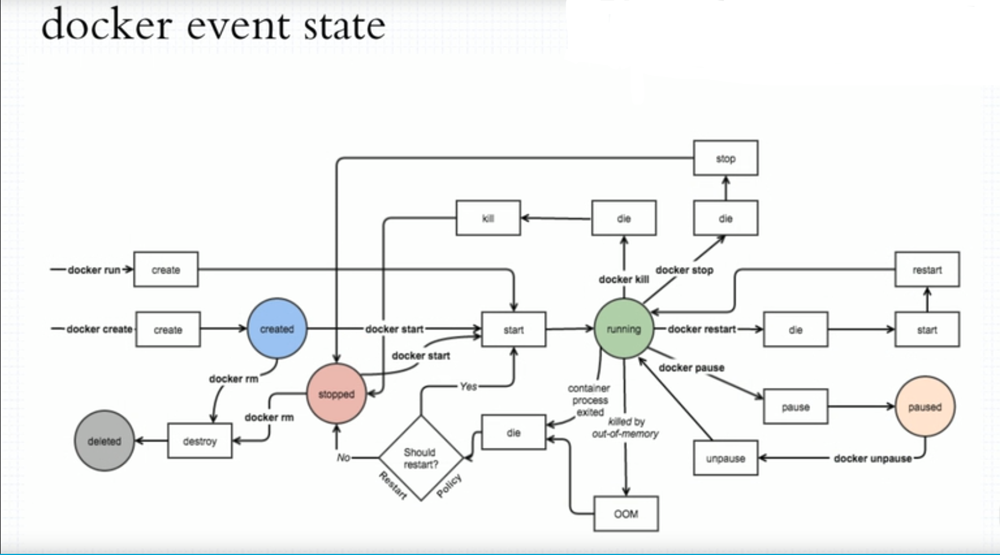
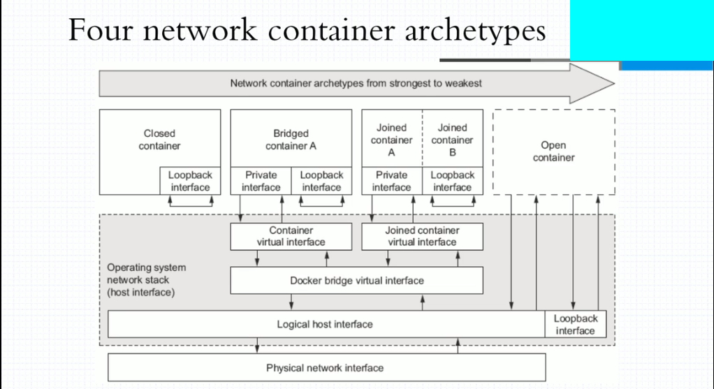
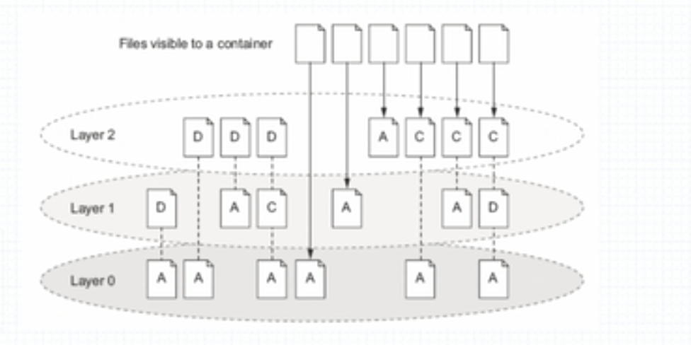

# Docker基础

---

### 安装

- ##### Ubuntu

  1. 安装docker：`wget -qO- https://get.docker.com/ | sh`
  2. 当要以非root用户可以直接运行docker时，需要执行`sudo usermod -aG docker 用户名`命令，然后重新登陆，否则会有报错。

- #### CentOS

  1. `yum install -y yum-utils device-mapper-persistent-data lvm2`
  2. `yum-config-manager --add-repo http://mirrors.aliyun.com/docker-ce/linux/centos/docker-ce.repo`
  3. `yum makecache fast`
  4. `yum -y install docker-ce`
  5. `systemctl start docker`

### 命令补全

> 在个别`Linux`系统发行版上无法补全命令子选项，原因是缺少依赖工具`bash-completion`

1. `yum install -y bash-completion`
2. `source /usr/share/bash-completion/bash_completion`
3. `source /usr/share/bash-completion/completions/docker`

### 镜像加速

> 配置文件在：`/etc/docker/daemon.json`

```shell
{
  "registry-mirrors": ["http://hub-mirror.c.163.com"]
}
```

### Docker容器实现基础

- `Liunx Namespace`

  > Linux命名空间是对全局系统资源的一种封装隔离，实现了每个命名空间下有专属自己的一套系统资源（`信号量`、`网络设备`、`文件系统`、`进程编号`、`用户和用户组`、`主机名和NIS域名`、`cgroup根目录`）且每个命名空间里的进程无法感知其他命名空间的进程，因此每个命名空间下的进程都认为自己置身于一个独立的系统中。

- `Linux Cgroups`

  > `cgroups`是Linux内核提供的一种可以限制单个进程或者多个进程所使用资源的机制，可以对 cpu，内存等资源实现精细化的控制， `cgroups`提供的精细化控制能力，限制某一个或者某一组进程的资源使用。比如在一个既部署了前端 web 服务，也部署了后端计算模块的八核服务器上，可以使用`cgroups`限制 web server 仅可以使用其中的六个核，把剩下的两个核留给后端计算模块。

- `Linux联合挂载`

  > 任何程序运行时都会有依赖，无论是开发语言层的依赖库，还是各种系统lib、操作系统等，不同的系统上这些库可能是不一样的，或者有缺失的。为了让容器运行时一致，docker将依赖的操作系统、各种lib依赖整合打包在一起（即镜像），然后容器启动时，作为它的根目录（根文件系统rootfs），使得容器进程的各种依赖调用都在这个根目录里，这样就做到了环境的一致性。
  >
  > 不过，这时你可能已经发现了另一个问题：难道每开发一个应用，都要重复制作一次rootfs吗（那每次pull/push一个系统岂不疯掉）？
  >
  > 比如，我现在用Debian操作系统的ISO做了一个rootfs，然后又在里面安装了Golang环境，用来部署我的应用A。那么，我的另一个同事在发布他的Golang应用B时，希望能够直接使用我安装过Golang环境的rootfs，而不是重复这个流程，那么本文的主角UnionFS就派上用场了。
  >
  > Docker镜像的设计中，引入了层（layer）的概念，也就是说，用户制作镜像的每一步操作，都会生成一个层，也就是一个增量rootfs（一个目录），这样应用A和应用B所在的容器共同引用相同的Debian操作系统层、Golang环境层（作为只读层），而各自有各自应用程序层，和可写层。启动容器的时候通过UnionFS把相关的层挂载到一个目录，作为容器的根文件系统。
  >
  > 需要注意的是，rootfs只是一个操作系统所包含的文件、配置和目录，并不包括操作系统内核。这就意味着，如果你的应用程序需要配置内核参数、加载额外的内核模块，以及跟内核进行直接的交互，你就需要注意了：这些操作和依赖的对象，都是宿主机操作系统的内核，它对于该机器上的所有容器来说是一个“全局变量”，牵一发而动全身。
  >
  > ---
  >
  > 原文：https://blog.csdn.net/songcf_faith/article/details/82787946 

### Docker事件处理流程图



### Docker网络模式



- `Host`模式

  > 宿主机在同一个网络中，但没有独立IP地址。启动容器的时候使用`host`模式，那么这个容器将不会获得一个独立的`Network Namespace`，而是和宿主机共用一个`Network Namespace`。容器将不会虚拟出自己的网卡，配置自己的IP等，而是使用宿主机的IP和端口。

- `Container`模式

  > 指定新创建的容器和已经存在的一个容器共享一个`Network Namespace`，而不是和宿主机共享。新创建的容器不会创建自己的网卡，配置自己的IP，而是和一个指定的容器共享IP、端口范围等。同样，两个容器除了网络方面，其他的如文件系统、进程列表等还是隔离的。两个容器的进程可以通过lo网卡设备通信。

- `None`模式

  > 该模式将容器放置在它自己的网络栈中，但是并不进行任何配置。实际上，该模式关闭了容器的网络功能，在以下两种情况下是有用的：容器并不需要网络（例如只需要写磁盘卷的批处理任务）。

- `Bridge`模式

  > 容器使用独立`Network Namespace`，并连接到`docker0`虚拟网卡（默认模式）。通过`docker0`网桥以及`Iptables nat表`配置与宿主机通信；`bridge`模式是Docker默认的网络设置，此模式会为每一个容器分配`Network Namespace`、设置IP等，并将一个主机上的Docker容器连接到一个虚拟网桥上

### Dokcer网络

> `Docker`网络默认使用`nat`模式，使用`Docker0`虚拟网卡进行桥接，因此可以对`Docker0`进行配置修改，同时也支持新增虚拟网卡。

### Docker文件目录层



> `Docker`的容器在运行中的目录加载规则如上，`Docker`使用的文件系统使用`overlay2`分层结构，因此在容器启动的时候会加载多个目录层，其中最底层为只读层，最高层可写层，当在容器中对文件、目录进行修改时只能修改可写层，只读层的文件并不会真实的被删除、修改而是对用户透明。

### Docker数据卷（Volumes）

> - 数据卷的存在是为了数据的持久化保存。当一个容器内的文件、目录被用户进行操作时，所执行的操作只保存在容器的可写层，那么在容器被删除后所有可写层的数据都将会丢失。而容器卷就是为了将数据保存在一个持久化的数据卷中（可以是持久化数据中心、宿主机的磁盘等）。
> - `Docker`有两种类型的数据卷，分别是：
>   - `Bind mount volume`：直接与宿主机的目录进行挂载。
>   - `Docker managed volume`：`Docker`自身管理的数据卷，与宿主机的挂载目录由`Docker`自动分配

### Docker命令类型

> - `Docker`命令分`Docker管理命令`和`Docker对象命令`，如：
>   - 管理命令：
>     - `docker info`（获取`Docker`信息）
>     - .....
>   - 对象命令：
>     - `docker image`（管理`Docker`镜像）
>     - `docker container`（管理`Docker`容器）
>
> - 所有命令可使用`docker help`查看，管理命令是初始版本`Docker`为了方便操作的命令模式，后续为了清晰区分命令的作用产生了对象命令，部分管理命令在后续的版本中可能被移除。
>
> - 使用`docker 对象 -h`可查看管理该对象的所有命令选项。
