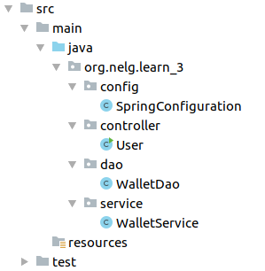

# IOC容器_无XML

---

- 目录



- 创建和使用

  1. 添加`WalletDao.java`文件，添加如下内容：

     ```java
     package org.nelg.learn_3.dao;
     
     public class WalletDao {
     
         public WalletDao() {
             System.out.println("Wallet Dao 对象被创建");
         }
     
         public void getMoney() {
             System.out.println("get Money from dao");
         }
     }
     ```

  2. 添加`WalletService.java`文件，添加如下内容：

     ```java
     package org.nelg.learn_3.service;
     
     import org.nelg.learn_3.dao.WalletDao;
     import org.springframework.beans.factory.annotation.Autowired;
     import org.springframework.beans.factory.annotation.Qualifier;
     import org.springframework.stereotype.Component;
     
     //如果注解中不填写值默认取类名，且首字母小写
     //@Component
     //亦可随意指定id值
     @Component("walletService")
     public class WalletService {
     
         @Autowired
         private WalletDao walletDao;
     
         public WalletService() {
             System.out.println("WalletService对象被创建");
         }
     
         public void getMoney() {
             this.walletDao.getMoney();
             System.out.println("get Money from service");
         }
     }
     ```

  3. 添加`SpringConfiguration.java`文件，添加如下内容：

     ```java
     package org.nelg.learn_3.config;
     
     import org.nelg.learn_3.dao.WalletDao;
     import org.springframework.context.annotation.Bean;
     import org.springframework.context.annotation.ComponentScan;
     import org.springframework.context.annotation.Configuration;
     
     //表明当前是一个配置类
     @Configuration
     //配置IOC容器的扫描路径
     @ComponentScan(basePackages = {"org.nelg.learn_3"})
     public class SpringConfiguration {
     
         @Bean(name = "walletDao")
         public WalletDao createWalletDao() {
             return new WalletDao();
         }
     }
     ```

  4. 使用，在`User.java`文件中，添加如下内容：

     ```java
     package org.nelg.learn_3.controller;
     
     import org.nelg.learn_3.config.SpringConfiguration;
     import org.nelg.learn_3.service.WalletService;
     import org.springframework.context.ApplicationContext;
     import org.springframework.context.annotation.AnnotationConfigApplicationContext;
     import org.springframework.context.support.ClassPathXmlApplicationContext;
     
     public class User {
     
         public static void main(String[] args) {
     
             //获取IOC容器对象
             ApplicationContext ac = new AnnotationConfigApplicationContext(SpringConfiguration.class);
     
             //更加id获取bean对象
             WalletService walletService = (WalletService) ac.getBean("walletService");
             walletService.getMoney();
         }
     }
     ```

- 依赖注入

  1. 通过注解进行依赖注入时，只需要在需要注入的地方添加`@Autowired`注解即可，如下：

     1. 修改`WalletDao.java`文件：

        ```java
        package org.nelg.learn_2.dao;
        
        import org.springframework.stereotype.Component;
        
        @Component
        public class WalletDao {
        
            public WalletDao() {
                System.out.println("Wallet Dao 对象被创建");
            }
        
            public void getMoney() {
                System.out.println("get Money from dao");
            }
        }
        ```

     2. 添加`@Autowired`注解：

        ```java
        package org.nelg.learn_2.service;
        
        import org.nelg.learn_2.dao.WalletDao;
        import org.springframework.beans.factory.annotation.Autowired;
        import org.springframework.stereotype.Component;
        
        import java.util.List;
        import java.util.Map;
        
        //如果注解中不填写值默认取类名，且首字母小写
        //@Component
        //亦可随意指定id值
        @Component("walletService")
        public class WalletService {
        
            @Autowired
            private WalletDao walletDao;
        
            public WalletService() {
                System.out.println("WalletService对象被创建");
            }
        
            public void getMoney() {
                this.walletDao.getMoney();
                System.out.println("get Money from service");
            }
        }
        ```

  2. 自动注入`@Autowired`获取容器的顺序：

     `private WalletDao walletDao1`

     如上：

     1. 若`Spring`管理的`IOC容器`中只有一个数据类型为`WalletDao`的容器，则自动注入该容器的对象
     2. 若`Spring`管理的`IOC容器`中有多个类型均为`WalletDao`（如`WalletDao类`被多个子类继承）的容器，则以变量名为ID查找`IOC容器`ID为`walletDao1`的容器对象进行注入
     3. 若`Spring`管理的`IOC容器`中有多个类型均为`WalletDao`（如`WalletDao类`被多个子类继承）的容器，可以在`@Autowired`注解下添加`@Qualifier("walletDao1")`指定注入的对象容器ID

- 注解解析
  - `@Import([config].class)`：添加更多配置类
  - `@PropertySource([configpath])`：读取配置文件，并通过`@Value("${name}")`的方式注入到属性中，详细见`learn_3`