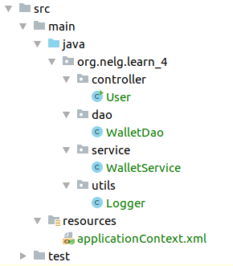

# AOP编程

---

- 概念

  > `AOP`切面编程是`Spring框架`携带的一种编程方式，可理解为中间件，主要作用是在不修改原有的业务逻辑下，给业务方法添加前置、后置、异常方法，增强原有方法，原理是`Java`的`动态代理`。在开始`AOP`编程前先解释以下基础概念。

  1. 连接点：所有可以被`Spring`进行`AOP`编程的方法都是连接点

  2. 切入点：被`Spring`拦截并进行增强的方法就是切入点

  3. 通知（增强）：

     > 通知（增强）即是指切入点被`Spring`拦截到后要做的事情，分为以下几种通知类型：

     1. 前置通知：即执行切入点之前的动作
     2. 后置通知：即执行切入点之后的动作
     3. 异常通知：即执行切入点异常时的动作
     4. 最终通知：即最终完成时的动作
     5. 环绕通知：手动编码前面的4个动作

- 目录

  

- 创建和使用（XML方式）

  1. 添加`WalletDao.java`文件，添加如下内容：

     ```java
     package org.nelg.learn_4.dao;
     
     import org.springframework.stereotype.Component;
     
     @Component("walletDao")
     public class WalletDao {
     
         public WalletDao() {
             System.out.println("Wallet Dao 对象被创建");
         }
     
         public void getMoney() {
             System.out.println("get Money from dao");
         }
     }
     ```

  2. 添加`WalletService.java`文件，添加如下内容：

     ```java
     package org.nelg.learn_4.service;
     
     import org.nelg.learn_4.dao.WalletDao;
     import org.springframework.beans.factory.annotation.Autowired;
     import org.springframework.beans.factory.annotation.Qualifier;
     import org.springframework.stereotype.Component;
     
     @Component("walletService")
     public class WalletService {
     
         @Autowired
         @Qualifier("walletDao")
         private WalletDao walletDao;
     
         public WalletService() {
             System.out.println("WalletService对象被创建");
         }
     
         public void getMoney() {
             this.walletDao.getMoney();
             System.out.println("get Money from service");
         }
     }
     ```

  3. 添加`Logger.java`文件，添加如下内容：

     ```java
     package org.nelg.learn_4.utils;
     
     import org.springframework.stereotype.Component;
     
     @Component
     public class Logger {
     
         public void printLog() {
             System.out.println("-----print logger-----");
         }
     }
     ```

  4. 在`resources`中添加配置文件`applicationContext.xml`，配置`AOP`设置：

     ```xml
     <?xml version="1.0" encoding="UTF-8"?>
     <beans xmlns="http://www.springframework.org/schema/beans"
            xmlns:xsi="http://www.w3.org/2001/XMLSchema-instance"
            xmlns:aop="http://www.springframework.org/schema/aop"
            xmlns:context="http://www.springframework.org/schema/context"
            xsi:schemaLocation="http://www.springframework.org/schema/beans
             http://www.springframework.org/schema/beans/spring-beans.xsd
             http://www.springframework.org/schema/context
             http://www.springframework.org/schema/context/spring-context.xsd
             http://www.springframework.org/schema/aop
             http://www.springframework.org/schema/aop/spring-aop.xsd">
     
         <!--设置需要扫描的包路径-->
         <context:component-scan base-package="org.nelg.learn_4"></context:component-scan>
     
         <!--配置AOP-->
         <aop:config>
             <!--配置切面-->
             <aop:aspect id="logAdvice" ref="logger">
                 <!--配置前置通知-->
                 <aop:before method="printLog" pointcut="execution(public void org.nelg.learn_4.service.WalletService.getMoney())"></aop:before>
             </aop:aspect>
         </aop:config>
     </beans>
     ```

  5. 使用，在`User.java`文件中，添加如下内容：

     ```java
     package org.nelg.learn_4.controller;
     
     import org.nelg.learn_4.service.WalletService;
     import org.springframework.context.ApplicationContext;
     import org.springframework.context.support.ClassPathXmlApplicationContext;
     
     public class User {
     
         public static void main(String[] args) {
     
             //获取IOC容器对象
             ApplicationContext ac = new ClassPathXmlApplicationContext("applicationContext.xml");
     
             //更加id获取bean对象
             WalletService walletService = (WalletService) ac.getBean("walletService");
             walletService.getMoney();
         }
     }
     ```

  6. 环绕通知的创建和使用：

     1. 修改`applicationContext.xml`文件如下：

        ```xml
        <?xml version="1.0" encoding="UTF-8"?>
        <beans xmlns="http://www.springframework.org/schema/beans"
               xmlns:xsi="http://www.w3.org/2001/XMLSchema-instance"
               xmlns:aop="http://www.springframework.org/schema/aop"
               xmlns:context="http://www.springframework.org/schema/context"
               xsi:schemaLocation="http://www.springframework.org/schema/beans
                http://www.springframework.org/schema/beans/spring-beans.xsd
                http://www.springframework.org/schema/context
                http://www.springframework.org/schema/context/spring-context.xsd
                http://www.springframework.org/schema/aop
                http://www.springframework.org/schema/aop/spring-aop.xsd">
        
            <!--设置需要扫描的包路径-->
            <context:component-scan base-package="org.nelg.learn_4"></context:component-scan>
        
            <!--配置AOP-->
            <aop:config>
                <!--配置切面-->
                <aop:aspect id="logAdvice" ref="logger">
                    <!--配置环绕通知-->
                    <aop:around method="printAroundLog" pointcut="execution(public void org.nelg.learn_4.service.WalletService.getMoney())"></aop:around>
                </aop:aspect>
            </aop:config>
        </beans>
        ```

     2. 修改`Logger.java`文件内容如下：

        ```java
        package org.nelg.learn_4.utils;
        
        import org.aspectj.lang.ProceedingJoinPoint;
        import org.springframework.stereotype.Component;
        
        @Component
        public class Logger {
        
            public void printLog() {
                System.out.println("-----print logger-----");
            }
        
            public Object printAroundLog(ProceedingJoinPoint pjp) {
                Object rtValue = null;
        
                try {
                    //得到方法执行所需要的参数
                    Object[] args = pjp.getArgs();
        
                    //手动书写通知
                    System.out.println("-----print logger before-----");
                    pjp.proceed(args);
                    System.out.println("-----print logger after-----");
                } catch (Throwable t) {
                    System.out.println("-----print logger error-----");
                    throw new RuntimeException(t);
                } finally {
                    System.out.println("-----print logger end-----");
                }
        
                return rtValue;
            }
        }
        ```

- 创建和使用（注解方式）

  1. 修改`applicationContext.xml`文件如下：

     ```xml
     <?xml version="1.0" encoding="UTF-8"?>
     <beans xmlns="http://www.springframework.org/schema/beans"
            xmlns:xsi="http://www.w3.org/2001/XMLSchema-instance"
            xmlns:aop="http://www.springframework.org/schema/aop"
            xmlns:context="http://www.springframework.org/schema/context"
            xsi:schemaLocation="http://www.springframework.org/schema/beans
             http://www.springframework.org/schema/beans/spring-beans.xsd
             http://www.springframework.org/schema/context
             http://www.springframework.org/schema/context/spring-context.xsd
             http://www.springframework.org/schema/aop
             http://www.springframework.org/schema/aop/spring-aop.xsd">
     
         <!--设置需要扫描的包路径-->
         <context:component-scan base-package="org.nelg.learn_4"></context:component-scan>
     
         <!--配置Spring开启注解AOP的支持-->
         <aop:aspectj-autoproxy></aop:aspectj-autoproxy>
     </beans>
     ```

  2. 修改`Logger.java`文件内容如下：

     ```java
     package org.nelg.learn_4.utils;
     
     import org.aspectj.lang.ProceedingJoinPoint;
     import org.aspectj.lang.annotation.Around;
     import org.aspectj.lang.annotation.Aspect;
     import org.aspectj.lang.annotation.Before;
     import org.aspectj.lang.annotation.Pointcut;
     import org.springframework.stereotype.Component;
     
     @Component
     //表示当前是一个切面类
     @Aspect
     public class Logger {
     
         //配置切面表达式
         @Pointcut("execution(public void org.nelg.learn_4.service.WalletService.getMoney())")
         private void pt1() {
         }
     
         @Before("pt1()")
         public void printLog() {
             System.out.println("-----print logger-----");
         }
     
         //@Around("execution(public void org.nelg.learn_4.service.WalletService.getMoney())")
         public Object printAroundLog(ProceedingJoinPoint pjp) {
             Object rtValue = null;
     
             try {
                 //得到方法执行所需要的参数
                 Object[] args = pjp.getArgs();
     
                 //手动书写通知
                 System.out.println("-----print logger before-----");
                 pjp.proceed(args);
                 System.out.println("-----print logger after-----");
             } catch (Throwable t) {
                 System.out.println("-----print logger error-----");
                 throw new RuntimeException(t);
             } finally {
                 System.out.println("-----print logger end-----");
             }
     
             return rtValue;
         }
     }
     ```
