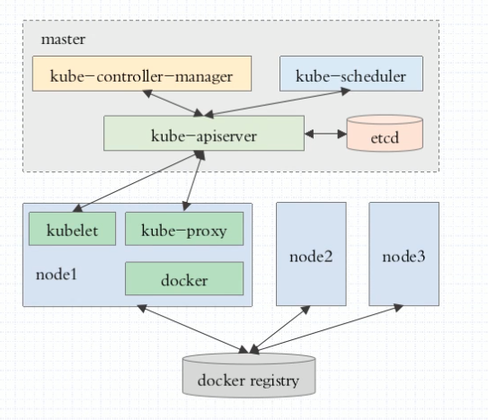

# Kubernetes基础

---

### Kubernetes软件架构图



### Kubernetes安装（CentOS）

> `Kubernetes`集群部署较为繁琐，因此官方提供了一个集安装、初始化集群、添加节点等功能的脚本工具`kubeadm`，我们可通过这个软件对`Kubernetes`集群进行初始化。

1. 修改YUM源，使用阿里云镜像
2. `yum install docker-ce kubelet-1.11.1 kubeadm-1.11.1 kubectl-1.11.1`

### Kubernetes集群初始化（CentOS）

1. 镜像下载，因国内无法下载，有以下三种方式进行`Kubernetes`依赖的镜像下载方式：

   1. 修改`/usr/lib/systemd/system/docker.service`,在`[Service]`中添加一个环境变量用于下载Kubernetes需要的`docker`镜像。

      ```shell
      [Service]
      Type=notify
      # the default is not to use systemd for cgroups because the delegate issues still
      # exists and systemd currently does not support the cgroup feature set required
      # for containers run by docker
      # 添加不可描述的环境变量
      Environment="HTTPS_PROXY=http://www.ik8s.io:10080"
      Environment="NO_PROXY=127.0.0.0/8,172.20.0.0/16"
      ExecStart=/usr/bin/dockerd -H fd:// --containerd=/run/containerd/containerd.sock
      ExecReload=/bin/kill -s HUP $MAINPID
      TimeoutSec=0
      RestartSec=2
      Restart=always
      ```

   2. 还有一种方式就是直接配置`/etc/hosts`文件，添加如下重写规则：

      ```shell
      # vim  /etc/hosts
      61.91.161.217 gcr.io 
      61.91.161.217 www.gcr.io 
      61.91.161.217 packages.cloud.google.com
      ```

      > 最新可用的Google hosts文件可在这里[获取](https://github.com/googlehosts/hosts)

   3. 最后一种方式就是使用国内镜像将`Kubernetes`需要的镜像都下载下来，然后把`Docker`的`tag`修改成需要的，地址：`registry.cn-hangzhou.aliyuncs.com/google_containers/<镜像名>:<版本号>`

      1. 如下载`Kubernetes-v1.11.1`，先预先下载下诉镜像：

         ```shell
         docker pull mirrorgooglecontainers/kube-apiserver-amd64:v1.11.1 && \
         docker pull mirrorgooglecontainers/kube-controller-manager-amd64:v1.11.1 && \
         docker pull mirrorgooglecontainers/kube-scheduler-amd64:v1.11.1 && \
         docker pull mirrorgooglecontainers/kube-proxy-amd64:v1.11.1 && \
         docker pull mirrorgooglecontainers/pause:3.1 && \
         docker pull mirrorgooglecontainers/etcd-amd64:3.2.18 && \
         docker pull registry.cn-beijing.aliyuncs.com/zhoujun/coredns:1.1.3
         ```

      2. 然后修改`tag`

         ```shell
         docker tag mirrorgooglecontainers/kube-apiserver-amd64:v1.11.1 k8s.gcr.io/kube-apiserver-amd64:v1.11.1 && \
         docker tag mirrorgooglecontainers/kube-controller-manager-amd64:v1.11.1 k8s.gcr.io/kube-controller-manager-amd64:v1.11.1 && \
         docker tag mirrorgooglecontainers/kube-scheduler-amd64:v1.11.1 k8s.gcr.io/kube-scheduler-amd64:v1.11.1 && \
         docker tag mirrorgooglecontainers/kube-proxy-amd64:v1.11.1 k8s.gcr.io/kube-proxy-amd64:v1.11.1 && \
         docker tag mirrorgooglecontainers/pause:3.1 k8s.gcr.io/pause:3.1 && \
         docker tag mirrorgooglecontainers/etcd-amd64:3.2.18 k8s.gcr.io/etcd-amd64:3.2.18 && \
         docker tag registry.cn-beijing.aliyuncs.com/zhoujun/coredns:1.1.3 k8s.gcr.io/coredns:1.1.3
         ```

      3. 删除多余`tag`

         ```shell
         docker image rm -f mirrorgooglecontainers/kube-apiserver-amd64:v1.11.1 && \
         docker image rm -f mirrorgooglecontainers/kube-controller-manager-amd64:v1.11.1 && \
         docker image rm -f mirrorgooglecontainers/kube-scheduler-amd64:v1.11.1 && \
         docker image rm -f mirrorgooglecontainers/kube-proxy-amd64:v1.11.1 && \
         docker image rm -f mirrorgooglecontainers/pause:3.1 && \
         docker image rm -f mirrorgooglecontainers/etcd-amd64:3.2.18 && \
         docker image rm -f registry.cn-beijing.aliyuncs.com/zhoujun/coredns:1.1.3
         ```

   >  推荐使用最后一种。

2. 确认`iptables`规则可写

   1. `cat /proc/sys/net/bridge/bridge-nf-call-iptables`
   2. `cat /proc/sys/net/bridge/bridge-nf-call-ip6tables`

   > 确认上述两个文件的值都是1。
   >
   > 若都不是1，解决方案是
   >
   > 1. `vim /etc/rc.d/rc.local`添加以下语句
   >
   > ```shell
   > echo 1 > /proc/sys/net/bridge/bridge-nf-call-iptables
   > echo 1 > /proc/sys/net/bridge/bridge-nf-call-ip6tables
   > ```
   >
   > 增加执行权限：`chmod +x　/etc/rc,d/rc.local`
   >
   > 2. `vim /etc/sysctl.conf`添加以下语句
   >
   > ```shell
   > net.bridge.bridge-nf-call-ip6tables = 1
   > net.bridge.bridge-nf-call-iptables = 1
   > net.bridge.bridge-nf-call-arptables = 1
   > net.ipv4.ip_forward=1
   > ```
   >
   > 添加后执行：`sysctl -p`
   >
   > *推荐使用第二种*

3. 设置开机启动

   1. `systemctl enable docker`
   2. `systemctl enable kubelet`

4. 因为`Kubernetes`文件驱动默认为`systemd`， 而我们安装的`docker`使用的文件驱动是`cgroupfs`, 造成不一致, 导致镜像无法启动,修改如下配置：

   ```shell
   # vi vi /etc/sysconfig/kubelet，修改
   KUBELET_EXTRA_ARGS="--cgroup-driver=cgroupfs"
   ```

5. 从`Kubernetes1.8`开始要求关闭系统的`Swap`，如果不关闭，默认配置下kubelet将无法启动。

   1. 关闭系统`Swap`

   2. 将`Kubernetes`的`Swap`检查关闭

      ```shell
      # vi vi /etc/sysconfig/kubelet，修改
      KUBELET_EXTRA_ARGS="--cgroup-driver=cgroupfs --fail-swap-on=false"
      ```

6. 更新`kubelet`service，`systemctl daemon-reload`

   > `kubelet`还有另一个地方可以修改环境变量值：
   >
   > `/etc/systemd/system/kubelet.service.d/10-kubeadm.conf`

7. 初始化master

   > - `--pod-network-cidr=10.244.0.0/16`：在Kubeadm的文档中，Pod Network的安装是作为一个单独的步骤的。kubeadm init并没有选择一个默认的Pod network进行安装。这里采用Flannel 作为Pod network，如果我们要使用Flannel，那么在执行init时，按照kubeadm文档要求，我们必须给init命令带上option：–pod-network-cidr=10.244.0.0/16
   > - `--ignore-preflight-errors=Swap`：忽略错误检查列表
   > - `--apiserver-advertise-address`：因我使用的是阿里云，网卡地址和公网地址不一致，因此需要指定控制台的IP地址

   ```shell
   kubeadm init --apiserver-advertise-address="<IP地址>" --kubernetes-version=v1.11.1 --pod-network-cidr=10.244.0.0/16 --ignore-preflight-errors=Swap,NumCPU,SystemVerification
   ```

8. 部署`flannel`

   >  从Github上面搜索`flannel`，并找到`coreos/flannel`，提示`k8s-1.7`以上可直接用以下命令创建`flannel`

   ```shell
   kubectl apply -f https://raw.githubusercontent.com/coreos/flannel/master/Documentation/kube-flannel.yml
   ```

9. 因为我搭建的两台服务器都是云服务器且内网IP不通，因此可以使用`iptables`规则进行ip重定向，操作如下：

   1. 开启`iptables`转发

      ```shell
      # vim /etc/sysctl.conf
      net.ipv4.ip_forward=1
      ```

   2. 使配置生效：`sysctl -p`

   3. 添加`iptables`规则

      ```shell
      # 在主节点中添加如下iptables规则
      iptables -t nat -A OUTPUT -d <目标节点的内网ip地址> -j DNAT --to <目标节点的公网ip地址>
      # 有些服务器会提示转发连接超时，添加如下iptables规则
      iptables -t nat -I POSTROUTING -o eth0 -s <目标节点的内网ip地址> -j MASQUERADE
      ```

10. `kubectl`命令补全

   ```shell
   # vi ~/.bashrc
   source <(kubectl completion bash)
   ```

   > 保存执行 `source ~/.bashrc`
