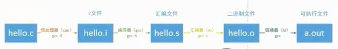

# GCC工作流程

---

### GCC工作流程

1. 预处理

   - gcc参数：`--E`

   - 执行操作：

     - 宏替换
     - 头文件展开
     - 注释删除

   - 文件转换：`xxx.c->xxx.i`

     >  `.i`文件还是一个`C文件`，只是已经展开了代码信息以及去除了冗余信息。

2. 编译

   - gcc参数：`--S`

   - 执行操作：

     - 将`.i`格式的C源码转换成汇编代码

   - 文件转换：`xxx.i->xxx.s`

     > `.s`文件是汇编源码文件。

3. 汇编

   - gcc参数：`-c`

   - 执行操作：

     - 将汇编源代码编译成二进制机器码

   - 文件转换：`xxx.s->xxx.o`

     > `.o`文件是二进制文件

4. 链接

   - gcc参数：无

   - 执行操作：

     - 将各个二进制文件链接起来生成可执行程序

   - 文件转换：`xxx.o->xxx`

     > `xxx`是可执行程序，也是二进制文件

### GCC工作流程图

> 虽然在编译程序的时候只用了`gcc`命令，但并不只用了`GCC`一个软件，在编译过程中`GCC`除了将`.i`格式的文件编译成汇编器之外，其余步骤都调用了其他软件来协助执行。

`GCC`调用软件流程如下：

1. 预处理：调用了`cpp`软件（非`C++`文件格式）将`.c`格式的`C`代码信息展开和去除冗余信息
2. 编译：`GCC`自身处理，将`.i`格式的`C`代码编译成汇编代码
3. 汇编：调用了`as`软件将汇编代码编译成机器码
4. 链接：调用了`ld`软件将各个二进制文件链接生成可执行程序

