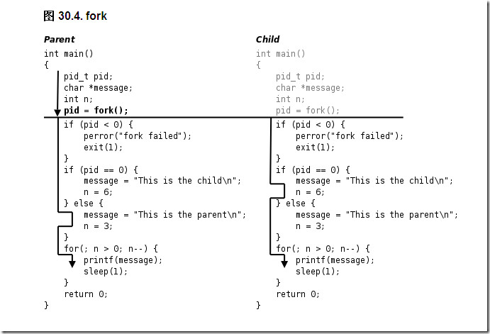

# fork进程分支详解

### 头文件

```c
#include <sys/types.h> 
#include <unistd.h>
```

### 功能解析



1. 父进程初始化。
2. 父进程调用fork，这是一个系统调用，因此进入内核。
3. 内核根据父进程复制出一个子进程，父进程和子进程的PCB信息相同，用户态代码和数据也相同。因此，子进程现在的状态看起来和父进程一样，做完了初始化，刚调用了fork进入内核，还没有从内核返回。
4. 现在有两个一模一样的进程看起来都调用了fork进入内核等待从内核返回（实际上fork只调用了一次），此外系统中还有很多别的进程也等待从内核返回。是父进程先返回还是子进程先返回，还是这两个进程都等待，先去调度执行别的进程，这都不一定，取决于内核的调度算法。
5. 如果某个时刻父进程被调度执行了，从内核返回后就从fork函数返回，保存在变量pid中的返回值是子进程的id，是一个大于0的整数，因此执下面的else分支，然后执行for循环，打印"This is the parent\n"三次之后终止。
6. 如果某个时刻子进程被调度执行了，从内核返回后就从fork函数返回，保存在变量pid中的返回值是0，因此执行下面的if (pid == 0)分支，然后执行for循环，打印"This is the child\n"六次之后终止。fork调用把父进程的数据复制一份给子进程，但此后二者互不影响，在这个例子中，fork调用之后父进程和子进程的变量message和n被赋予不同的值，互不影响。
7. 父进程每打印一条消息就睡眠1秒，这时内核调度别的进程执行，在1秒这么长的间隙里（对于计算机来说1秒很长了）子进程很有可能被调度到。同样地，子进程每打印一条消息就睡眠1秒，在这1秒期间父进程也很有可能被调度到。所以程序运行的结果基本上是父子进程交替打印，但这也不是一定的，取决于系统中其它进程的运行情况和内核的调度算法，如果系统中其它进程非常繁忙则有可能观察到不同的结果。另外，读者也可以把sleep(1);去掉看程序的运行结果如何。
8. 这个程序是在Shell下运行的，因此Shell进程是父进程的父进程。父进程运行时Shell进程处于等待状态，当父进程终止时Shell进程认为命令执行结束了，于是打印Shell提示符，而事实上子进程这时还没结束，所以子进程的消息打印到了Shell提示符后面。最后光标停在This is the child的下一行，这时用户仍然可以敲命令，即使命令不是紧跟在提示符后面，Shell也能正确读取。

> fork函数的特点概括起来就是“调用一次，返回两次”，在父进程中调用一次，在父进程和子进程中各返回一次。从上图可以看出，一开始是一个控制流程，调用fork之后发生了分叉，变成两个控制流程，这也就是“fork”（分叉）这个名字的由来了。子进程中fork的返回值是0，而父进程中fork的返回值则是子进程的id（从根本上说fork是从内核返回的，内核自有办法让父进程和子进程返回不同的值），这样当fork函数返回后，程序员可以根据返回值的不同让父进程和子进程执行不同的代码。

> fork的返回值这样规定是有道理的。fork在子进程中返回0，子进程仍可以调用getpid函数得到自己的进程id，也可以调用getppid函数得到父进程的id。在父进程中用getpid可以得到自己的进程id，然而要想得到子进程的id，只有将fork的返回值记录下来，别无它法。

> fork的另一个特性是所有由父进程打开的描述符都被复制到子进程中。父、子进程中相同编号的文件描述符在内核中指向同一个file结构体，也就是说，file结构体的引用计数要增加。

