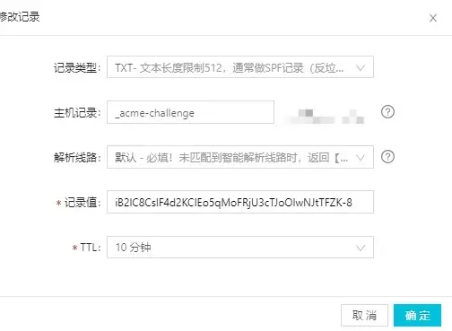

# HTTPS服务器搭建

---

### 免费证书

1. 如果是CentOS 6、7，先执行：`yum install epel-release`

2. `cd /root/` 

3. 下载免费证书生成脚本：`wget https://dl.eff.org/certbot-auto --no-check-certificate`

4. 更改脚本执行权限：`chmod +x ./certbot-auto`

5. 安装脚本所需依赖：`./certbot-auto -n`

6. 生成证书：

   ```shell
   #单域名生成证书：
   ./certbot-auto certonly --email 邮箱地址 --agree-tos --no-eff-email --staging --webroot -w 项目根目录(入口文件目录) -d 项目域名
   
   #多域名单目录生成单证书：(即一个网站多个域名使用同一个证书)
   ./certbot-auto certonly --email youemail@vpser.net --agree-tos --no-eff-email --staging --webroot -w 项目根目录(入口文件目录) -d 项目域名 -d 项目域名
   
   #多域名多目录生成一个证书：(即一次生成多个域名的一个证书)
   ./certbot-auto certonly --email  您的email --agree-tos --no-eff-email --staging --webroot -w 项目根目录(入口文件目录) -d 项目域名 -d 项目域名 -w 项目根目录(入口文件目录) -d 项目域名 -d 项目域名
   ```

   > 生成的证书会存在：`/etc/letsencrypt/live/域名/` 目录下

7. 定时器里加上如下规则：

   `0 3 */30 * * /root/certbot-auto renew --disable-hook-validation --renew-hook "lnmp nginx reload"`

8. 修改nginx配置：

   ```shell
   server{
           listen 443 ssl;
           server_name 域名;
           index index.html index.htm index.php default.html default.htm default.php;
           root  项目根目录;
           #前面生成的证书，改一下里面的域名就行
           ssl_certificate /etc/letsencrypt/live/域名/fullchain.pem; 
           #前面生成的密钥，改一下里面的域名就行
           ssl_certificate_key /etc/letsencrypt/live/域名/privkey.pem;
           ssl_ciphers "EECDH+CHACHA20:EECDH+CHACHA20-draft:EECDH+AES128:RSA+AES128:EECDH+AES256:RSA+AES256:EECDH+3DES:RSA+3DES:!MD5";
           ssl_protocols TLSv1 TLSv1.1 TLSv1.2;
           ssl_prefer_server_ciphers on;
           ssl_session_cache shared:SSL:10m;
   
           #error_page   404   /404.html;
           include enable-php-pathinfo.conf;
   
           location ~ .*\.(gif|jpg|jpeg|png|bmp|swf)$
           {
               expires      30d;
           }
   
           location ~ .*\.(js|css)?$
           {
               expires      12h;
           }
    }
   ```

9. 执行：`lnmp reload`

### 使用`Let's Encrypt`脚本生成免费证书（浏览器认证安全）

1. 如果是CentOS 6、7，先执行：`yum install epel-release`

2. `cd /root/` 

3. 下载`Let's Encrypt`：`git clone https://github.com/letsencrypt/letsencrypt`

4. `cd letsencrypt`

5. `./certbot-auto certonly -d <域名> --manual --preferred-challenges dns --server https://acme-v02.api.letsencrypt.org/directory`

   > | 参数                       | 说明                                                         |
   > | -------------------------- | ------------------------------------------------------------ |
   > | certonly                   | 表示安装模式，Certbot 有安装模式和验证模式两种类型的插件。   |
   > | --manual                   | 表示手动安装插件，Certbot 有很多插件，不同的插件都可以申请证书，用户可以根据需要自行选择 |
   > | -d                         | 为那些主机申请证书，如果是通配符，输入 *.you.cn（可以替换为你自己的一级域名） |
   > | --preferred-challenges dns | 使用 DNS 方式校验域名所有权                                  |
   > | --server                   | Let's Encrypt ACME v2 版本使用的服务器不同于 v1 版本，需要显示指定。 |

6. 输入邮箱地址

   ```shell
   Dependency Installed:
     dwz.x86_64 0:0.11-3.el7             perl-srpm-macros.noarch 0:1-8.el7             tcl.x86_64 1:8.5.13-8.el7             tix.x86_64 1:8.4.3-12.el7             tk.x86_64 1:8.5.13-6.el7             tkinter.x86_64 0:2.7.5-69.el7_5            
   
   Complete!
   Creating virtual environment...
   Installing Python packages...
   Installation succeeded.
   Saving debug log to /var/log/letsencrypt/letsencrypt.log
   Plugins selected: Authenticator manual, Installer None
   Enter email address (used for urgent renewal and security notices) (Enter 'c' to
   cancel): 123@163.com
   ```

7. 选择安装配置

   ```shell
   - - - - - - - - - - - - - - - - - - - - - - - - - - - - - - - - - - - - - - - -
   Please read the Terms of Service at
   https://letsencrypt.org/documents/LE-SA-v1.2-November-15-2017.pdf. You must
   agree in order to register with the ACME server at
   https://acme-v02.api.letsencrypt.org/directory
   - - - - - - - - - - - - - - - - - - - - - - - - - - - - - - - - - - - - - - - -
   (A)gree/(C)ancel: A
   - - - - - - - - - - - - - - - - - - - - - - - - - - - - - - - - - - - - - - - -
   Would you be willing to share your email address with the Electronic Frontier
   Foundation, a founding partner of the Let's Encrypt project and the non-profit
   organization that develops Certbot? We'd like to send you email about our work
   encrypting the web, EFF news, campaigns, and ways to support digital freedom.
   - - - - - - - - - - - - - - - - - - - - - - - - - - - - - - - - - - - - - - - -
   (Y)es/(N)o: N
   Obtaining a new certificate
   Performing the following challenges:
   dns-01 challenge for kuaichuangkeji.com
   
   - - - - - - - - - - - - - - - - - - - - - - - - - - - - - - - - - - - - - - - -
   NOTE: The IP of this machine will be publicly logged as having requested this
   certificate. If you're running certbot in manual mode on a machine that is not
   your server, please ensure you're okay with that.
   
   Are you OK with your IP being logged?
   - - - - - - - - - - - - - - - - - - - - - - - - - - - - - - - - - - - - - - - -
   (Y)es/(N)o: Y
   ```

   > - 是否同意 Let's Encrypt 协议要求=>需要同意
   > - 是否分享你的邮箱
   > - 询问是否对域名和机器（IP）进行绑定=>需要同意

8. 配置`DNS TXT`记录，从而校验域名所有权，也就是判断证书申请者是否有域名的所有权

   ```shell
   - - - - - - - - - - - - - - - - - - - - - - - - - - - - - - - - - - - - - - - -
   Please deploy a DNS TXT record under the name
   _acme-challenge.you.cn with the following value:
   
   RYtObhDvEcXewZckknNQkBKIkvwIlbb4PNRel74LNwU
   
   Before continuing, verify the record is deployed.
   - - - - - - - - - - - - - - - - - - - - - - - - - - - - - - - - - - - - - - - -
   Press Enter to Continue
   ```

   > 上面输出要求给` _acme-challenge.you.cn` 配置一条 TXT 记录，在没有确认 TXT 记录生效之前不要回车执行，，控制台具体操作如下图所示：
   >
   > 
   >
   > **注：是新增一条TXT记录，当前域名的解析记录还是要保留**

9. 回车执行

   ```shell
   IMPORTANT NOTES:
    - Congratulations! Your certificate and chain have been saved at:
      /etc/letsencrypt/live/you.cn/fullchain.pem
      Your key file has been saved at:
      /etc/letsencrypt/live/you.cn/privkey.pem
      Your cert will expire on 2019-02-27. To obtain a new or tweaked
      version of this certificate in the future, simply run certbot-auto
      again. To non-interactively renew *all* of your certificates, run
      "certbot-auto renew"
    - If you like Certbot, please consider supporting our work by:
   
      Donating to ISRG / Let's Encrypt:   https://letsencrypt.org/donate
      Donating to EFF:                    https://eff.org/donate-le
   ```

   > 出现此提示代表配置成功，后续配置与上述免费证书配置一样

10. 证书续签，使用`crontab`定期执行

    `0 */12 * * * certbot renew --quiet --renew-hook "lnmp nginx reload"`

    > 注:证书在到期前30天才会续签成功,但为了确保证书在运行过程中不过期,官方建议每天自动执行续签两次

### HTTPS访问经常失败解决方案

- 原因：

  > 通过参考网上的资料，发生的原因：开启了net.ipv4.tcp_tw_recycle，在负载均衡只做NAT的情况下，触发了大量的TCP建连失败。

- 解决方案：

  1. 打开`/etc/sysctl.conf`文件
  2. 在文件最下方添加：`net.ipv4.tcp_timestamps=0`

- 参考资料：

  - 解决方案：

    https://blog.csdn.net/zhuyiquan/article/details/68925707

  - TCP服务端收到syn但是不回复syn ack：

    http://blog.csdn.net/jueshengtianya/article/details/52130667

  - TCP/IP TIME_WAIT状态原理：

    http://elf8848.iteye.com/blog/1739571 

  - 记一次TIME_WAIT网络故障：

    http://dngood.blog.51cto.com/446195/988968/

  - 微信小程序https连接服务器请求经常失败，请求超时：

    https://blog.csdn.net/wkyb608/article/details/79312121

### Nginx推荐HTTPS配置

```shell
server{
		listen 80;
        listen 443 ssl;
        server_name https://www.example.com;
        index index.html index.htm index.php default.html default.htm default.php;
        root  /var/www/website/example/;
	
		# 跨域
		add_header Access-Control-Allow-Origin *;
	    add_header Access-Control-Allow-Headers X-Requested-With;
	    add_header Access-Control-Allow-Methods GET,POST,OPTIONS;

     	# HSTS的合理使用，max-age表明HSTS在浏览器中的缓存时间，includeSubdomainscam参数指定应该在所有子域上启用HSTS，preload参数表示预加载，通过Strict-Transport-Security: max-age=0将缓存设置为0可以撤销HSTS
    	add_header Strict-Transport-Security "max-age=63072000; includeSubdomains; preload";

		ssl on;
		#免去客户端再去 CA 服务器验证的动作
		ssl_stapling on;
        ssl_stapling_verify on;
        # 证书位置
		ssl_certificate   /cert/215035186720457.pem;
		ssl_certificate_key  /cert/215035186720457.key;
		# 分配10MB的共享内存缓存，不同工作进程共享TLS会话信息
   		ssl_session_cache shared:SSL:10m;
		# 设置会话缓存过期时间24h    	
		ssl_session_timeout 1440m;

    	# 指定TLS协议的版本，不安全的SSL2和SSL3要废弃掉
    	ssl_protocols TLSv1 TLSv1.1 TLSv1.2;
    	# 启用ssl_prefer_server_ciphers，用来告诉Nginx在TLS握手时启用服务器算法优先，由服务器选择适配算法而不是客户端
    	ssl_prefer_server_ciphers on;	
     	# 优先选择支持前向加密的算法，且按照性能的优先顺序排列
    	ssl_ciphers 'ECDHE-RSA-AES128-GCM-SHA256:ECDHE-ECDSA-AES128-GCM-SHA256:ECDHE-RSA-AES256-GCM-SHA384:ECDHE-ECDSA-AES256-GCM-SHA384:DHE-RSA-AES128-GCM-SHA256:DHE-DSS-AES128-GCM-SHA256:kEDH+AESGCM:ECDHE-RSA-AES128-SHA256:ECDHE-ECDSA-AES128-SHA256:ECDHE-RSA-AES128-SHA:ECDHE-ECDSA-AES128-SHA:ECDHE-RSA-AES256-SHA384:ECDHE-ECDSA-AES256-SHA384:ECDHE-RSA-AES256-SHA:ECDHE-ECDSA-AES256-SHA:DHE-RSA-AES128-SHA256:DHE-RSA-AES128-SHA:DHE-DSS-AES128-SHA256:DHE-RSA-AES256-SHA256:DHE-DSS-AES256-SHA:DHE-RSA-AES256-SHA:ECDHE-RSA-DES-CBC3-SHA:ECDHE-ECDSA-DES-CBC3-SHA:AES128-GCM-SHA256:AES256-GCM-SHA384:AES128-SHA256:AES256-SHA256:AES128-SHA:AES256-SHA:AES:CAMELLIA:DES-CBC3-SHA:!aNULL:!eNULL:!EXPORT:!DES:!RC4:!MD5:!PSK:!aECDH:!EDH-DSS-DES-CBC3-SHA:!EDH-RSA-DES-CBC3-SHA:!KRB5-DES-CBC3-SHA';
    
        error_page   404   https://www.example.com;
        include enable-php-pathinfo.conf;
    	include enable-php.conf;
    
        location ~ .*\.(gif|jpg|jpeg|png|bmp|swf)$
        {
            expires      30d;
        }
    
        location ~ .*\.(js|css)?$
        {
            expires      12h;
        }
    
    	location ~ /.well-known {
            allow all;
    	}
        access_log  /var/www/logs/www.log;

 }
```

