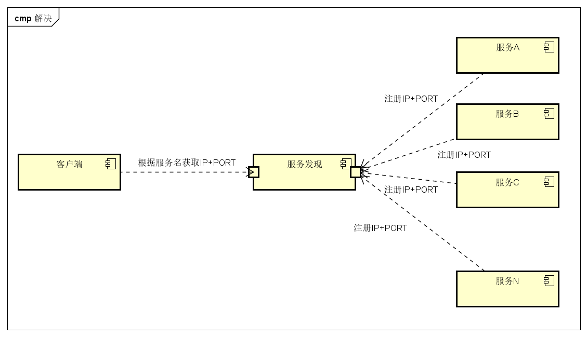

# Consul介绍

---

参考资料：https://blog.csdn.net/bbwangj/article/details/81116505

### Consul的作用

> 在微服务架构下`Consul`通常作为服务发现/注册的中间件使用。在以往的情况下，当一个客户端需要调用多种服务的时候需要在本地配置文件或获取一个单独接口来获取各个服务的地址和端口。而通过`Consul`可解决服务发现、健康检查、多数据中心等等的问题。以上两种方式可通过下图对比区别。

- 过往做法

  

- 解决方法

  

### Consul工作模式

- CLIENT（客户端模式）

  >  CLIENT表示consul的client模式，就是客户端模式。是consul节点的一种模式，这种模式下，所有注册到当前节点的服务会被转发到SERVER，本身是不持久化这些信息。

- SERVER（服务端模式）

  >  SERVER表示consul的server模式，表明这个consul是个server，这种模式下，功能和CLIENT都一样，唯一不同的是，它会把所有的信息持久化的本地，这样遇到故障，信息是可以被保留的。

- SERVER-LEADER（服务端-领导人）

  > 表明这个SERVER是它们的老大，它和其它SERVER不一样的一点是，它需要负责同步注册的信息给其它的SERVER，同时也要负责各个节点的健康监测。其它信息其它信息包括它们之间的通信方式，还有一些协议信息，算法。它们是用于保证节点之间的数据同步，实时性要求等等一系列集群问题的解决

- 协作图

  

### 安装

- 在[Consul官网](https://www.consul.io/downloads.html)下载自己需要的版本
- 解压文件后只有一个可执行文件，将其移动到`/usr/local/bin`或`/usr/bin`文件夹中。