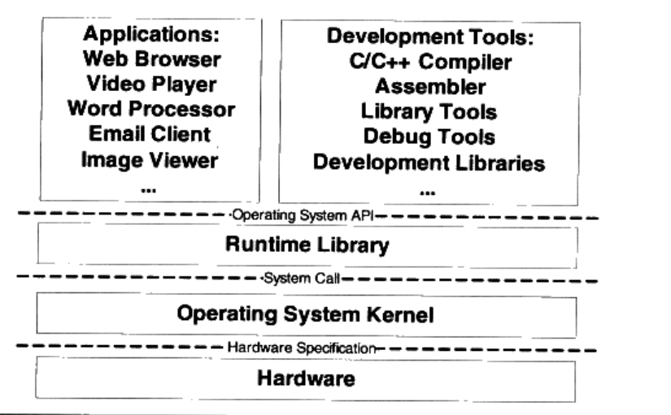
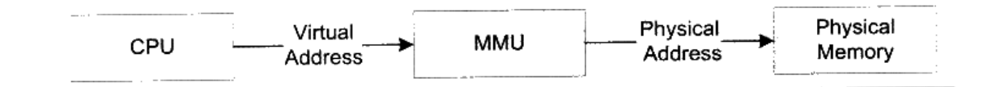

# 编程基础知识点

### 计算机软件体系

- 每个层次之间都须要相互通信，既然须要通信就必须有一个通信的协议，我们一般将其称为`接口（Interface）`，接口的下面那层是接口的提供者，由它定义接口；接口的上面那层是接口的使用者，它使用该接口来实现所需要的功能。
- 应用程序接口的提供者是运行库，什么样的运行库提供什么样的API，比如Linux下的Glibc库提供POSIX的API；Windows的运行库提供Windows API，最常见的32位Windows提供的API又被称为Win32。
- 运行库使用操作系统提供的`系统调用接口（System call Interface）`，系统调用接口在实现中往往以软件中断（Software Interrupt）的方式提供，比如Linux使用0x80号中断作为系统调用接口，Windows使用0x2E号中断作为系统调用接口（从Windows XP Sp2开始，Windows开始采用一种新的系统调用方式）。
- 操作系统内核层对于硬件层来说是硬件接口的使用者，而硬件是接口的定义者，硬件的接口定义决定了操作系统内核，具体来讲就是驱动程序如何操作硬件，如何与硬件进行通信。这种接口往往被叫做`硬件规格（Hardware Specification）`

### 操作系统的作用

> 操作系统的一个功能是提供抽象的接口，另外一个主要功能是管理硬件资源。

- 在计算机发展早期，CPU资源十分昂贵，如果一个CPU只能运行一个程序，那么当程序读写磁盘（当时可能是磁带）时，CPU就空闲下来了，这在当时简直就是暴殄天物。于是人们很快编写了一个监控程序，当某个程序暂时无须使用CPU时，监控程序就把另外的正在等待CPU资源的程序启动，使得CPU能够充分地利用起来。这种被称为`多道程序（Multiprogramming）`

- 经过稍微改进，程序运行模式变成了一种协作的模式，即每个程序运行一段时间以后都主动让出CPU给其他程序，使得一段时间内每个程序都有机会运行一小段时间。这对于一些交互式的任务尤为重要，比如点击一下鼠标或按下一个键盘按键后，程序所要处理的任务可能并不多，但是它需要尽快地被处理，使得用户能够立即看到效果。这种程序协作模式叫做`分时系统（Time-Sharing System）`

  > 缺点：如果一个程序在进行一个很耗时的计算，一直霸占着CPU不放，那么操作系统也没办法，其他程序都只有等着，整个系统看过去好像死机了一样。比如一个程序进入了一个while(1)的死循环，那么整个系统都停止了。

- `多任务（Multi-tasking）系统`，操作系统接管了所有的硬件资源，并且本身运行在一个受硬件保护的级别。所有的应用程序都以`进程（Process）`的方式运行在比操作系统权限更低的级别，每个进程都有自己独立的地址空间，使得进程之间的地址空间相互隔离。CPU由操作系统统一进行分配，每个进程根据进程优先级的高低都有机会得到CPU，但是，如果运行时间超出了一定的时间，操作系统会暂停该进程，将CPU资源分配给其他等待运行的进程。这种CPU的分配方式即所谓的抢占式（Preemptive），操作系统可以强制剥夺CPU资源并且分配给它认为目前最需要的进程。如果操作系统分配给每个进程的时间都很短，即CPU在多个进程间快速地切换，从而造成了很多进程都在同时运行的假象。

### 扇区

- 硬盘基本存储单位为`扇区（Sector）`，每个扇区一般为512字节。一个硬盘往往有多个盘片，每个盘片分两面，每面按照同心圆划分为若干个磁道，每个磁道划分为若干个扇区。比如一个硬盘有2个盘片，每个盘面分65 536磁道，每个磁道分1 024个扇区，那么硬盘的容量就是2 * 2 * 65 536 * 1 024 * 512 = 137 438 953 472字节（128GB）。但是我们可以想象，每个盘面上同心圆的周长不一样，如果按照每个磁道都拥有相同数量的扇区，那么靠近盘面外围的磁道密度肯定比内圈更加稀疏，这样是比较浪费空间的。但是如果不同的磁道扇区数又不同，计算起来就十分麻烦。为了屏蔽这些复杂的硬件细节，现代的硬盘普遍使用一种叫做LBA（Logical Block Address）的方式，即整个硬盘中所有的扇区从0开始编号，一直到最后一个扇区，这个扇区编号叫做逻辑扇区号。逻辑扇区号抛弃了所有复杂的磁道、盘面之类的概念。当我们给出一个逻辑的扇区号时，硬盘的电子设备会将其转换成实际的盘面、磁道等这些位置。

### 分页

- 内存分页主要是为了解决运行应用程序时，应用程序占据数据量较大容易占满内存，因此当程序运行时，不经常使用的数据段会缓存到磁盘中，最小的缓存单位为`页`

### 虚拟内存

- 虚拟内存的出现是为了包含系统运行的稳定性。假设所有的应用程序操作的是真实的物理地址，那么当一个程序无意或恶意操作其他应用程序的内存地址时会造成其他应用程序甚至系统的崩溃。

- 虚拟存储的实现需要依靠硬件的支持，对于不同的CPU来说是不同的。但是几乎所有的硬件都采用一个叫`MMU（Memory Management Unit）`的部件来进行页映射，在页映射模式下，CPU发出的是`Virtual Address`，即我们的程序看到的是虚拟地址。经过`MMU`转换以后就变成了`Physical Address`。一般MMU都集成在CPU内部了，不会以独立的部件存在。

  

